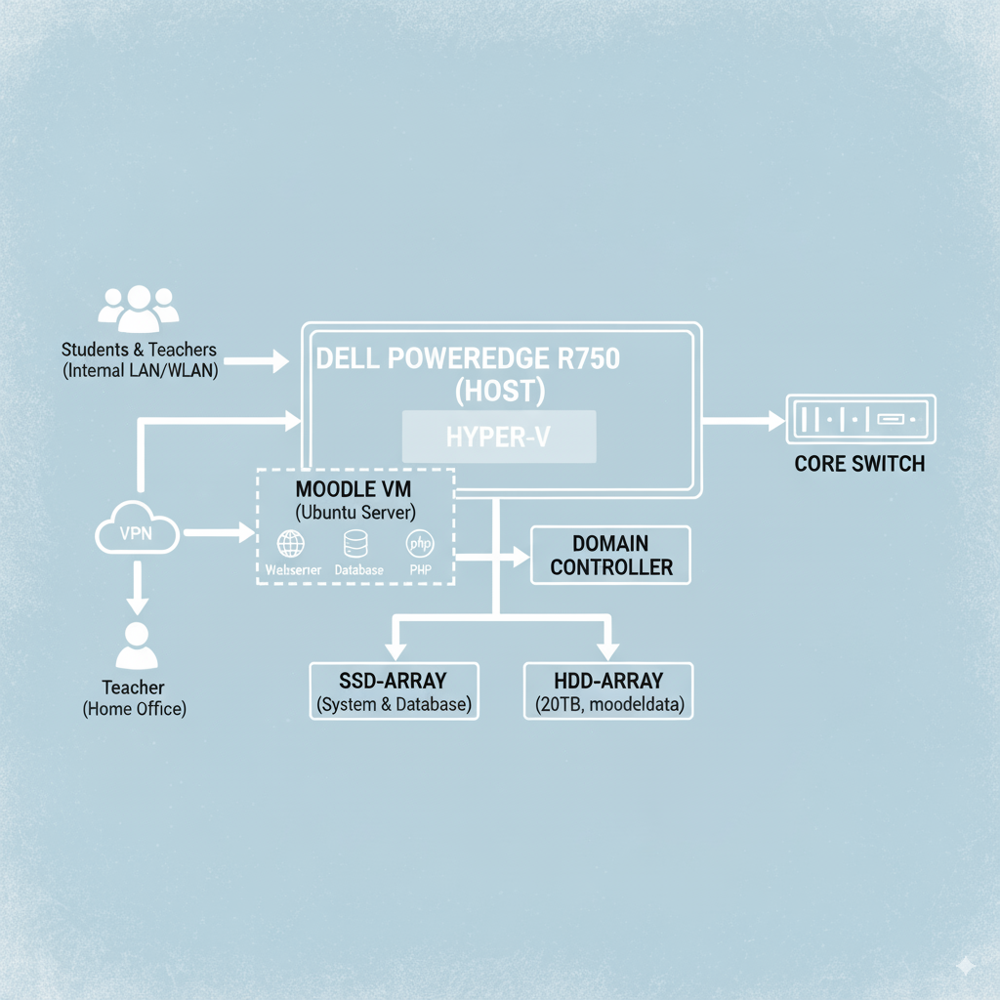

### **Evaluation und Konzeption der Lernplattform Moodle**

Dieses Dokument detailliert die Entscheidung für Moodle als Lernplattform, die benötigten Ressourcen, die damit verbundenen Kosten und sinnvolle Erweiterungsmöglichkeiten.

#### **1. Warum Moodle? (Strategische Entscheidung)**

Für die Auswahl der zentralen Lernplattform wurde eine Bedarfsanalyse durchgeführt. Die Entscheidung für Moodle basiert auf folgenden strategischen Vorteilen, die ideal zu den Zielen der Hans-Memling-Schule passen:

*   **Kosteneffizienz (Open Source):** Moodle ist eine Open-Source-Software. Es fallen **keine Lizenzgebühren** für die Software selbst an. Das Budget kann somit vollständig in robuste Hardware und qualifizierte Dienstleistung investiert werden, anstatt in wiederkehrende Lizenzkosten.

*   **Marktstandard im Bildungssektor:** Moodle ist die weltweit führende Lernplattform und hat sich an unzähligen Schulen, Hochschulen und Universitäten als De-facto-Standard etabliert. Dies garantiert eine kontinuierliche Weiterentwicklung, hohe Stabilität und eine große Community für Unterstützung.

*   **Pädagogische Flexibilität:** Moodle ist nicht nur eine Dateiablage, sondern ein vollwertiges pädagogisches Werkzeug. Es unterstützt diverse Lehr- und Lernszenarien durch Funktionen wie Foren, Wikis, interaktive Tests (Quizzes), Abgabe-Tools, Peer-Reviews und vieles mehr.

*   **Zukunftssicherheit und Erweiterbarkeit:** Durch eine riesige Auswahl an kostenlosen und kommerziellen Plugins kann Moodle jederzeit an zukünftige Anforderungen angepasst werden (z.B. Anbindung von Videokonferenzsystemen, Plagiatsprüfungen oder interaktiven Lerninhalten).

*   **Datenhoheit und Unabhängigkeit:** Da die Schule die Moodle-Instanz auf ihrem eigenen Server betreibt, behält sie die volle Kontrolle über alle sensiblen Daten von Lehrern und Schülern. Es besteht keine Abhängigkeit von externen Cloud-Anbietern und deren Geschäftsbedingungen.

#### **2. Benötigte Ressourcen (Technische Anforderungen)**

Um Moodle für ca. 600 Schüler und 25 Lehrkräfte performant zu betreiben, wird eine dedizierte virtuelle Maschine (VM) auf dem zentralen Server eingerichtet.

**Spezifikation der Moodle-VM (`HMS-MOODLE-01`):**

| Ressource | zugewiesen | Begründung |
| :--- | :--- | :--- |
| **vCPUs (Kerne)** | 6 Kerne | Ausreichend Leistung für gleichzeitige Zugriffe, Datenbankabfragen und das Ausführen von Hintergrundprozessen. |
| **RAM (Arbeitsspeicher)** | 16 GB RAM | Wichtig für schnelles Caching von Anfragen und eine flüssige Benutzererfahrung, insbesondere bei Tests oder Kurszugriffen. |
| **Speicher (System)** | 150 GB (vom SSD-Array) | Für das Betriebssystem (Ubuntu Server 22.04 LTS), die Moodle-Anwendung, die Datenbank und Caches. Der SSD-Speicher sorgt für extrem schnelle Ladezeiten. |
| **Speicher (Daten)** | angebunden an das HDD-Array | Das `moodledata`-Verzeichnis, in dem alle hochgeladenen Kursmaterialien liegen, wird auf dem großen Daten-Array (20 TB) gespeichert. |

**Wichtiger Hinweis:** Diese Ressourcen sind in der Spezifikation des zentralen Servers (Dell PowerEdge R750) **bereits berücksichtigt und eingeplant.**

**Architektur-Schaubild**

Zur visuellen Veranschaulichung der geplanten technischen Architektur dient das folgende Schaubild. Es zeigt das Zusammenspiel der zentralen Komponenten vom Benutzerzugriff bis zur Datenspeicherung.

**Erläuterung des Schaubilds:**

**Zentraler Host:** Der physische Server "Dell PowerEdge R750" bildet die Hardware-Grundlage. Darauf läuft die Virtualisierungssoftware Hyper-V, die den Betrieb mehrerer unabhängiger Systeme ermöglicht.

**Virtuelle Maschinen (VMs):** Für die Lernplattform wird eine eigene VM mit dem Betriebssystem Ubuntu Server aufgesetzt. Eine zweite VM dient als Domain Controller zur Verwaltung der Benutzerkonten.

**Hybrid-Speicher:** Die Moodle-VM greift auf zwei Speichertypen zu. Das schnelle SSD-Array wird für das Betriebssystem und die Datenbank genutzt, um kurze Ladezeiten zu garantieren. Das große HDD-Array mit 20TB speichert die eigentlichen Kursinhalte (Dokumente, Videos etc.).

**Netzwerkzugriff:** Interne Nutzer greifen über das Schulnetzwerk (LAN/WLAN) auf den Server zu. Lehrkräfte im Homeoffice können sich über eine sichere VPN-Verbindung mit dem Netzwerk verbinden und haben so den gleichen Zugriff auf die Plattform.

#### **3. Kostenanalyse für Moodle**

Obwohl Moodle selbst kostenlos ist, verursacht der Betrieb indirekte Kosten, die im Projektbudget bereits enthalten sind:

| Kostenart | Zugeordneter Budgetposten | Begründung |
| :--- | :--- | :--- |
| **Hardware-Ressourcen** | Server-Infrastruktur (€ 14.000) | Die Moodle-VM nutzt einen Teil der Leistung des zentralen Servers. |
| **Software-Lizenzen** | Windows Server Datacenter (€ 6.500) Veeam Backup (€ 1.500) | Die VM wird auf dem lizenzierten Host betrieben und durch die lizenzierte Backup-Software gesichert. |
| **Personalkosten** | Projektarbeit / Arbeitszeit (€ 20.000) | Ca. **40 der 200 geplanten Stunden** sind für die Installation, Konfiguration, Absicherung und Dokumentation von Moodle vorgesehen. |

**Fazit Kosten:** Es entstehen **keine zusätzlichen Kosten**, die nicht bereits im Hauptbudget des Projektantrags aufgeführt sind.

#### **4. Sinnvolle Erweiterungen (Potenzial für die Zukunft)**

Über die Basisfunktionen hinaus können folgende Erweiterungen den pädagogischen Mehrwert von Moodle erheblich steigern. Diese sind **nicht Teil des initialen Projekts**, werden aber für eine spätere Projektphase empfohlen:

*   **Plugin "BigBlueButton" (Videokonferenzen):** Integration eines leistungsstarken, datenschutzkonformen Open-Source-Videokonferenzsystems direkt in die Moodle-Kurse. Damit kann Online-Unterricht nahtlos abgehalten werden.

*   **Plugin "H5P" (Interaktive Inhalte):** Ermöglicht Lehrkräften die einfache Erstellung von interaktiven Lerninhalten wie Lückentexten, Zuordnungsübungen oder interaktiven Videos direkt in Moodle.

*   **Thema "Fordson" oder "Edwiser RemUI":** Installation und Anpassung eines modernen, benutzerfreundlicheren Designs (Themes), das speziell für Schulen entwickelt wurde und die Navigation erleichtert.

*   **"Train the Trainer"-Workshop:** Ein gezielter Workshop für 2-3 IT-affine Lehrkräfte, die anschließend als Multiplikatoren ihr Wissen an das Kollegium weitergeben. Dies sichert die nachhaltige und effektive Nutzung der Plattform.